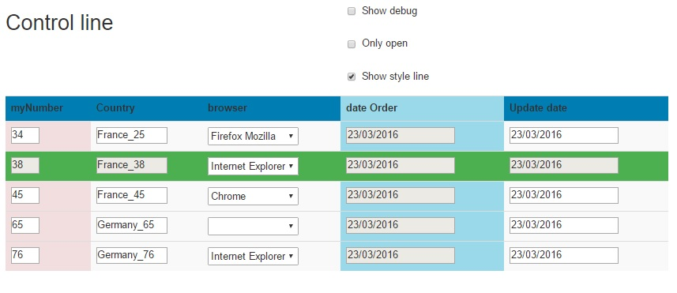
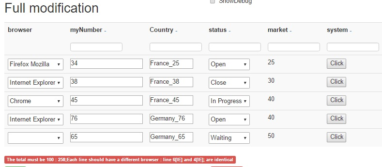
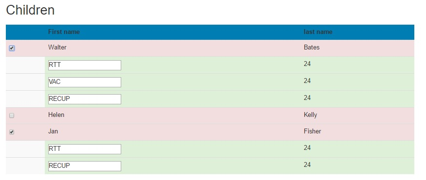

# widget_beartable

The Bear Table widget display data in a table, with the control:
* cell can be in read / write. On Write, different control are available : Text, Number, Lists, Date
* Filter on data, Sort on column are available
* control rule can be set : total of a column must be egal to 154 for example, all values in a column must be different (don't give 2 same country)
* color can be control
* line can be hide / show on expression 

Different control:

Control the color and the display

Display child and control the display
